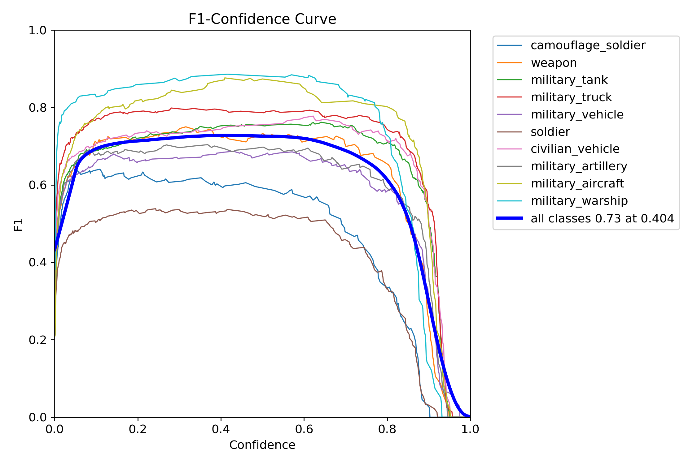
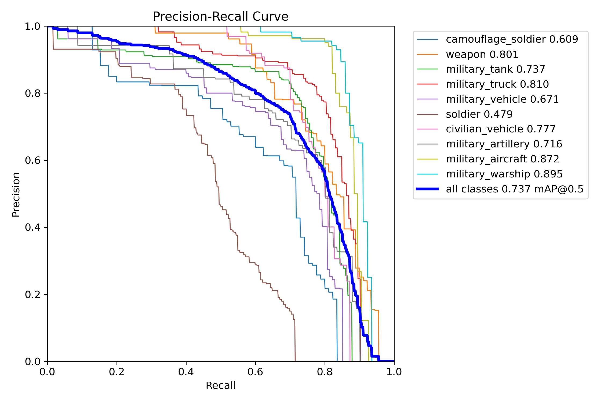
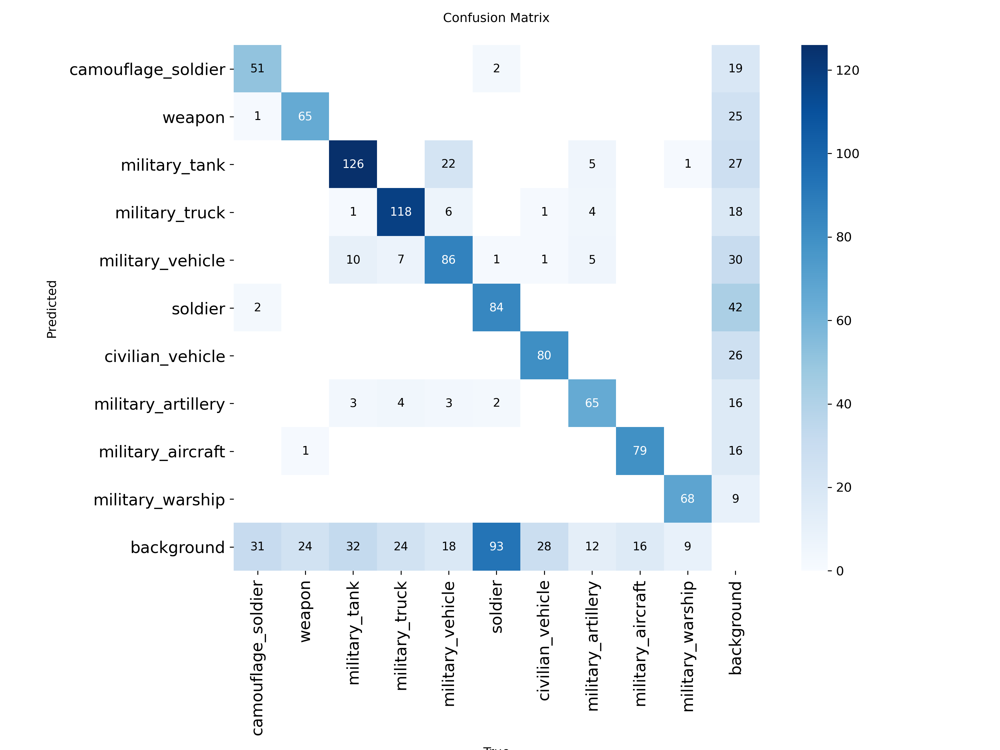
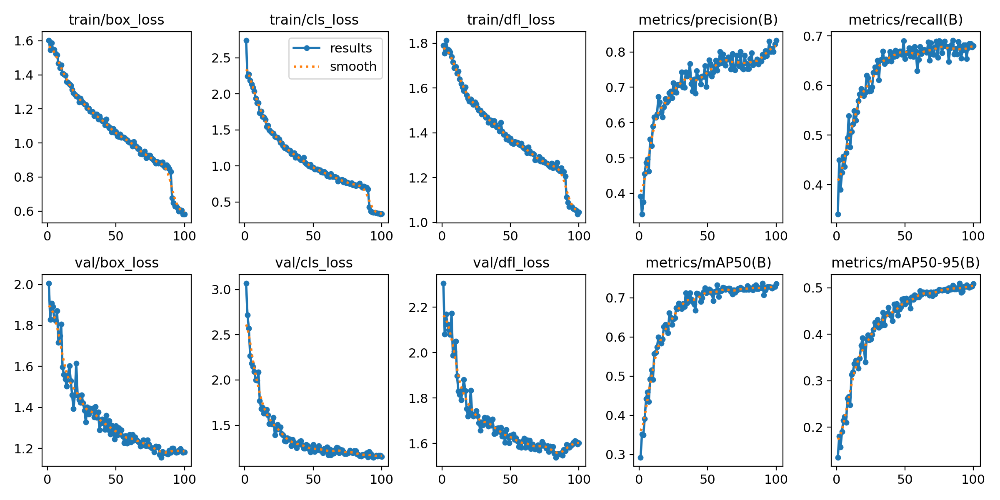

# 🛡️ AI-Powered Military Surveillance System

An advanced **real-time military surveillance system** built using **YOLOv8, OpenCV, and Optical Flow** for detecting, monitoring, and analyzing military assets in videos.

The system is capable of detecting multiple military objects such as **tanks, missiles, helicopters, soldiers, and military vehicles** while also analyzing their motion using **Optical Flow**.

---

## 🚀 Features

✅ Real-time Military Object Detection

✅ Detects multiple military assets

✅ Optical Flow-based Motion Analysis

✅ Video Inference on Custom Videos

✅ Automatic Output Video Saving

✅ Bounding Box Visualization

✅ Confidence Score Display

✅ Moving/Static Object Analysis

✅ Supports Webcam and Video Input

---
## 📊 Dataset, Training & Model

The model was trained using Kaggle GPU resources. You can access the complete training notebook, dataset, and download the trained model from the links below.

### 🔗 Kaggle Training Notebook

👉 **Notebook:**  
https://www.kaggle.com/code/kanhapatidar/military-object-detection/notebook

This notebook includes:

- Dataset Loading
- Data Preprocessing
- Dataset Balancing
- YOLOv8 Training
- Model Evaluation
- Result Visualization
- Model Export

---

### 📁 Dataset

👉 **Dataset:**  
https://www.kaggle.com/datasets/rawsi18/military-assets-dataset-12-classes-yolo8-format

Example:

```text
https://www.kaggle.com/datasets/your-username/military-dataset
```

---

### 🤖 Download Trained Model

The trained YOLOv8 model weights can be downloaded from the Kaggle notebook output section.

After opening the notebook:

1. Open the **Output** tab.
2. Locate the trained weights file:
   ```text
   best.pt
   ```
3. Click **Download** to download the model.

Alternatively, if you upload the model to Google Drive or GitHub Releases, provide the link below:

👉 **Model Download:**

```text
https://github.com/kanha165/ai-military-surveillance-system/releases
```

---
---
## 🎯 Detectable Classes

The model is trained to detect the following military assets:

- Tank
- Missile
- Soldier
- Military Vehicle
- Helicopter
- Fighter Jet
- Drone
- Radar
- Artillery
- Armored Vehicle
- Truck
- Warship

---

# 🏗️ Project Architecture

```text
Input Video/Webcam
        │
        ▼
YOLOv8 Object Detection
        │
        ▼
Military Asset Identification
        │
        ▼
Optical Flow Motion Analysis
        │
        ▼
Moving / Static Classification
        │
        ▼
Annotated Output Video
```

---

# 📂 Project Structure

```text
ai-military-surveillance-system/
│
├── main.py
├── README.md
├── requirements.txt
├── .gitignore
├── best1.pt
│
├── test_video.mp4
├── output_video.mp4
├── output_opticalflow.mp4
│
├── BoxF1_curve.png
├── BoxPR_curve.png
├── confusion_matrix.png
└── results.png
```

---

# 🖼️ Training Results

## 📈 F1 Curve



---

## 📈 Precision-Recall Curve



---

## 📊 Confusion Matrix



---

## 📉 YOLO Training Results



---

# ⚙️ Installation

Clone the repository:

```bash
git clone https://github.com/kanha165/ai-military-surveillance-system.git
```

Move into the project directory:

```bash
cd ai-military-surveillance-system
```

Install dependencies:

```bash
pip install -r requirements.txt
```

---

# 📦 Required Libraries

- Python 3.11+
- OpenCV
- NumPy
- Ultralytics YOLOv8

---

# 📝 requirements.txt

```txt
ultralytics
opencv-python
numpy
```

---

# ▶️ Running the Project

Place your trained YOLO model:

```text
best1.pt
```

Place the test video:

```text
test_video.mp4
```

Run:

```bash
python main.py
```

---

# 🎥 Input

The system accepts:

- Webcam Stream
- MP4 Videos
- AVI Videos

Example:

```python
video_path = "test_video.mp4"
```

---

# 📽️ Output

The system generates:

```text
output_video.mp4
```

or

```text
output_opticalflow.mp4
```

The output video contains:

- Detected Objects
- Class Labels
- Confidence Scores
- Motion Status (Moving/Static)

---

# 🧠 Optical Flow Integration

The project uses **Farneback Dense Optical Flow** to estimate motion between consecutive frames.

```python
flow = cv2.calcOpticalFlowFarneback(
    prev_gray,
    gray,
    None,
    0.5,
    3,
    15,
    3,
    5,
    1.2,
    0
)
```

This enables:

- Motion Estimation
- Moving Object Identification
- Static Object Detection

---

# 💻 Example Output

```text
tank 0.92 | Moving

missile 0.87 | Static

helicopter 0.95 | Moving
```

---

# 🔬 Technologies Used

| Technology | Purpose |
|------------|---------|
| Python | Programming Language |
| OpenCV | Computer Vision |
| YOLOv8 | Object Detection |
| Optical Flow | Motion Analysis |
| NumPy | Numerical Operations |

---

# 📊 Future Improvements

- [ ] Object Tracking (ByteTrack)
- [ ] Speed Estimation
- [ ] Heatmap Generation
- [ ] Intrusion Detection
- [ ] Suspicious Activity Detection
- [ ] Real-Time Alerts
- [ ] Streamlit Dashboard
- [ ] FastAPI Backend

---

# 🌟 Applications

- Border Surveillance
- Battlefield Monitoring
- Smart Military Security
- Intrusion Detection
- Autonomous Defense Systems

---

# 👨‍💻 Author

## Kanha Patidar

B.Tech CSIT Student | AI/ML Enthusiast | Computer Vision Developer

- GitHub: https://github.com/kanha165
- LinkedIn: https://www.linkedin.com/in/kanha-patidar/

---

# ⭐ Support

If you found this project useful, please consider giving it a **star ⭐** on GitHub.
